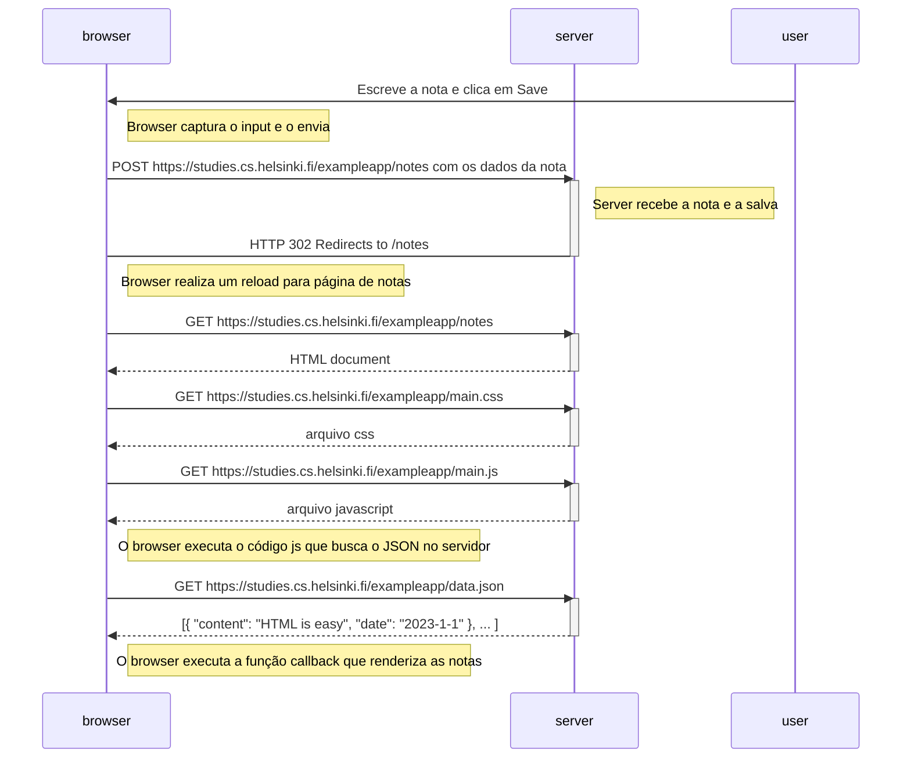

```mermaid


sequenceDiagram
    participant browser
    participant server
    participant user

    user->>browser: Escreve a nota e clica em Save
    Note right of browser: Browser captura o input e o envia


    browser->>server: POST https://studies.cs.helsinki.fi/exampleapp/notes com os dados da nota

    activate server
    Note right of server: Server recebe a nota e a salva
    server->browser: HTTP 302 Redirects to /notes
    deactivate server

    Note right of browser: Browser realiza um reload para página de notas

    browser->>server: GET https://studies.cs.helsinki.fi/exampleapp/notes
    activate server
    server-->>browser: HTML document
    deactivate server

    browser->>server: GET https://studies.cs.helsinki.fi/exampleapp/main.css
    activate server
    server-->>browser: arquivo css
    deactivate server

    browser->>server: GET https://studies.cs.helsinki.fi/exampleapp/main.js
    activate server
    server-->>browser: arquivo javascript
    deactivate server

    Note right of browser: O browser executa o código js que busca o JSON no servidor

    browser->>server: GET https://studies.cs.helsinki.fi/exampleapp/data.json
    activate server
    server-->>browser: [{ "content": "HTML is easy", "date": "2023-1-1" }, ... ]
    deactivate server

    Note right of browser: O browser executa a função callback que renderiza as notas
```
