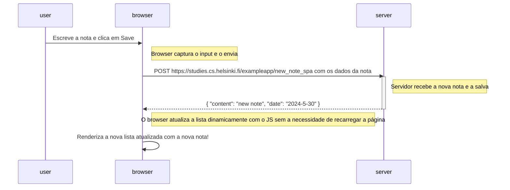

```mermaid
sequenceDiagram
    participant user
    participant browser
    participant server

    user->>browser: Escreve a nota e clica em Save
    Note right of browser: Browser captura o input e o envia

    browser->>server: POST https://studies.cs.helsinki.fi/exampleapp/new_note_spa com os dados da nota
    activate server
    Note right of server: Servidor recebe a nova nota e a salva
    server-->>browser: { "content": "new note", "date": "2024-5-30" }
    deactivate server

    Note right of browser: O browser atualiza a lista dinamicamente com o JS sem a necessidade de recarregar a página
    browser->>browser: Renderiza a nova lista atualizada com a nova nota!
```
